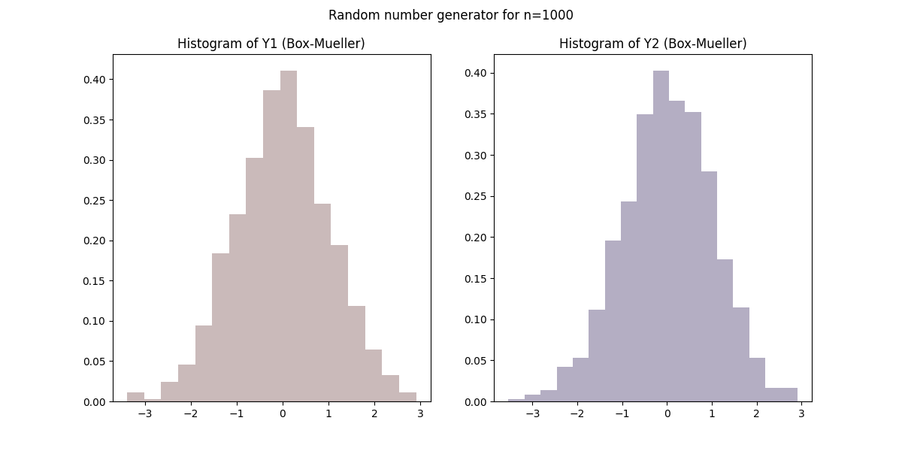
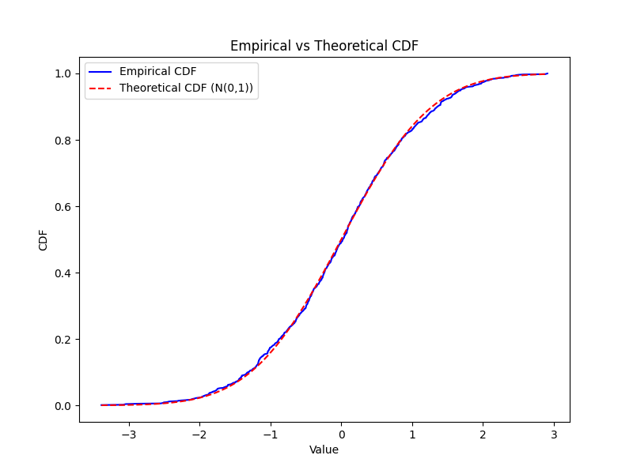
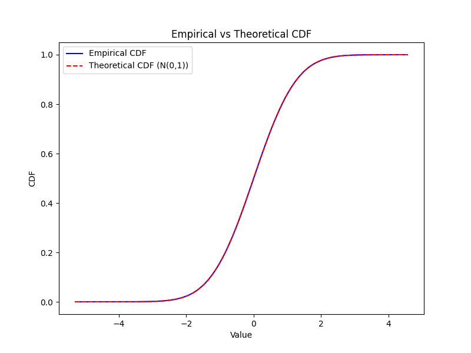
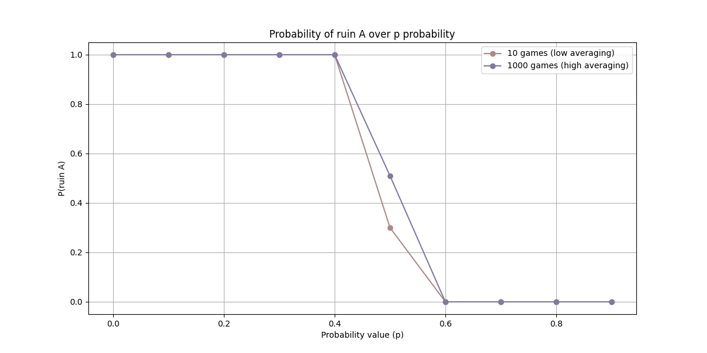

# statistic-methods

## 00-normal-distribution
Generate histograms and Cumulative Distribution Function for random variables generated using the Box-Muller transform.

### Histogram and CDF comparison
- For sample size `n=1000`

- For sample size `n=1000000`

## 01-gamblers-ruin
Simulation of the Gambler's Ruin.

### ex-01
Given initial capital for two players (const) and a **changing probability p** of passing $1 from Player A to Player B, calculate the probability of loosing the capital by Player A depending on **p probability**. 
Probability was estimated over 10 and 1000 games.

