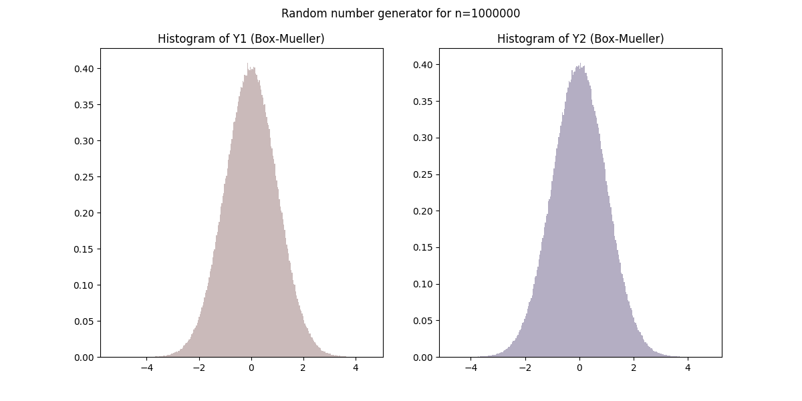
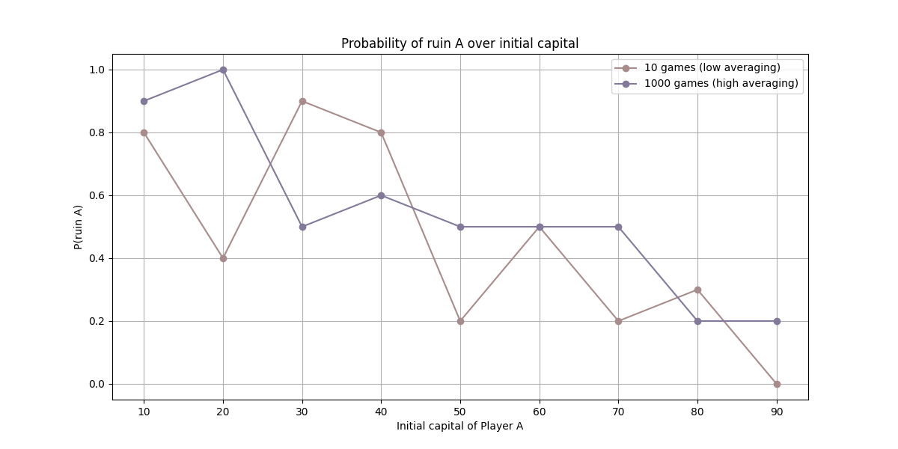
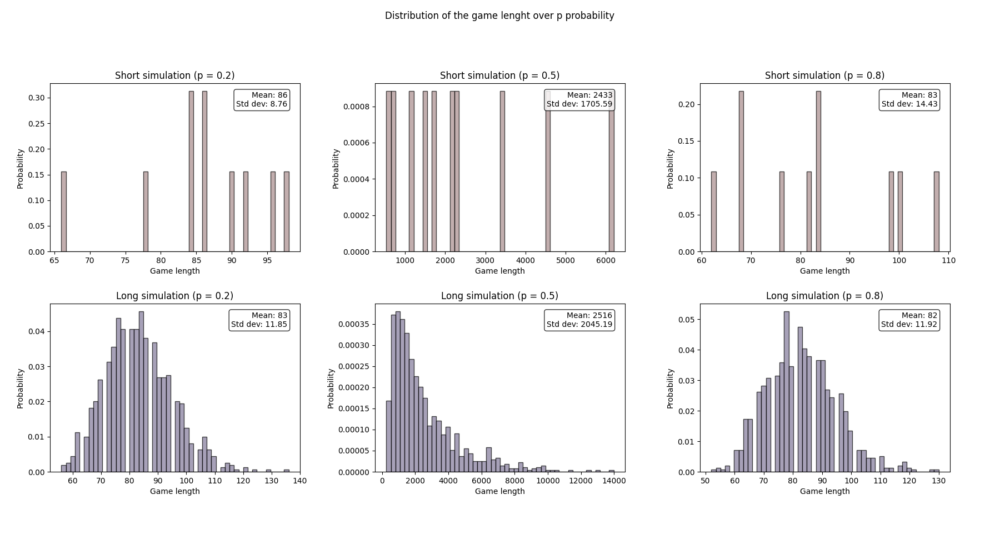
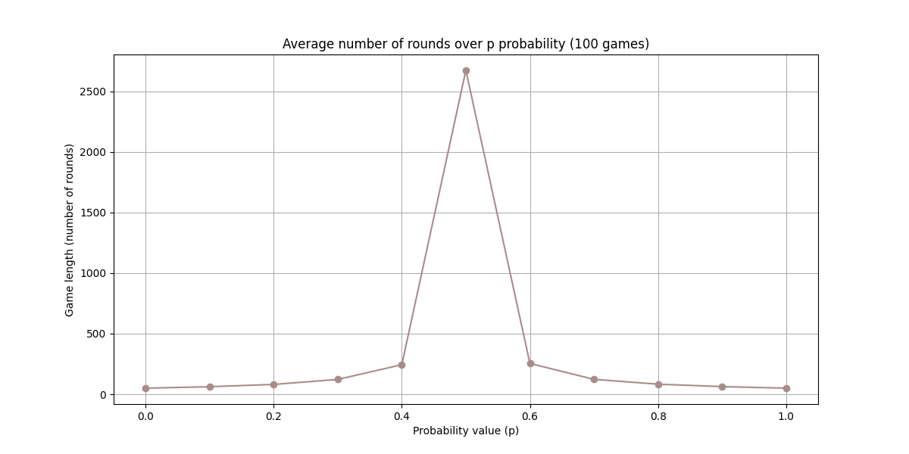

# statistic-methods

## 00-normal-distribution
Generate histograms and Cumulative Distribution Function for random variables generated using the Box-Muller transform.

### Histogram and CDF comparison
- For sample size `n=1000`

- For sample size `n=1000000`

## 01-gamblers-ruin
Simulation of the Gambler's Ruin.

### Exercise 1
Given the initial capital for two players `a = b = 50` and a **changing probability p** of passing $1 from Player B to Player A, estimate the probability of loosing the capital by Player A **depending on p probability**. 
Probability was estimated over 10 and 1000 games.

### Exercise 2
Given the probability of passing $1 from Player A to Player B `p = 0.5` and a **changing capital of Players A and B** (such that `a + b = 100`), estimate the probability of loosing the capital by Player A **depending on initial capital**. 
Probability was estimated over 10 and 1000 games.

### Exercise 3
Given the initial capital for two players `a = b = 50` and a **changing probability `p = [0.2, 0.5, 0.8]`** of passing $1 from Player B to Player B, create the distribution of game length probabilities **depending on p probability**.

### Exercise 4
Given the initial capital for two players `a = b = 50` and a **changing probability p** of passing $1 from Player A to Player B, estimate the average game length **depending on p probability**.

### Exercise 5
Given the initial capital for two players `a = b = 50`, **changing probability p `p = [0.2, 0.5]`** of passing $1 from Player A to Player B and **three cases of number of steps `n = [10, l_mean / 2, 0.9 * l_mean]`, where `l_mean` is the mean game length for given p value**, generate the distribution of the final capital of Player A **depending on p and n values**.

### Exercise 6
Given a sample of **chosen intitial capitals (such that `a + b = 100`) and p probabilities**, generate **trajectories of wins for both players over the number of games (counting processes)**.

